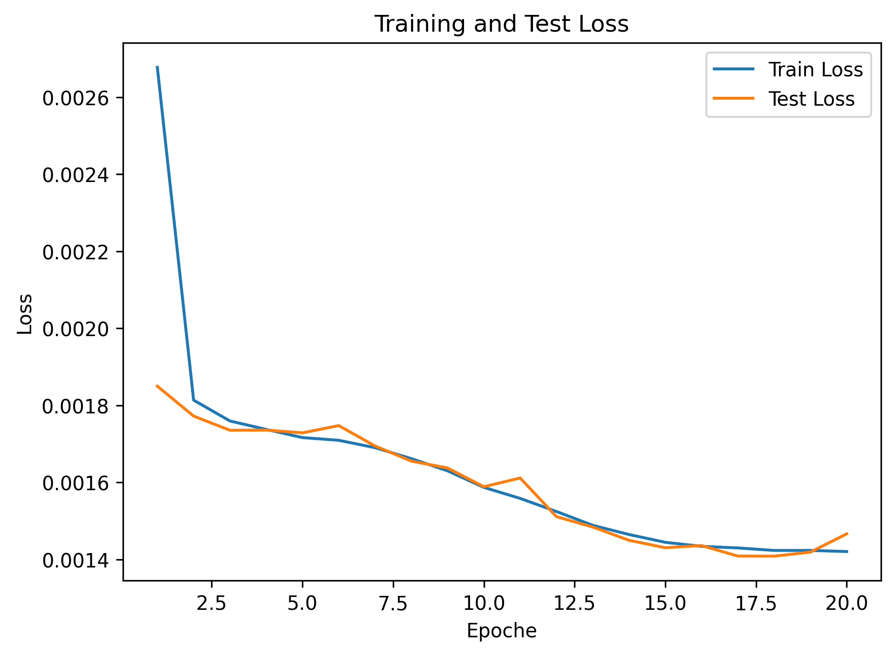
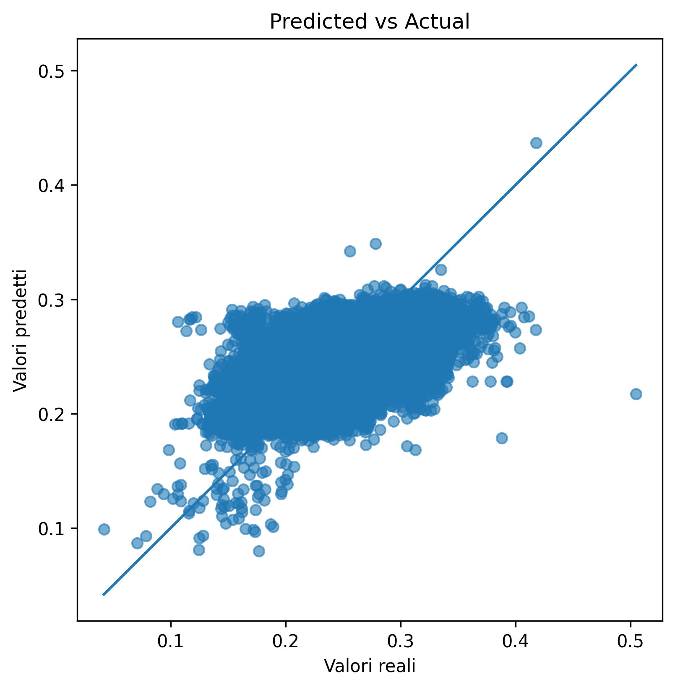
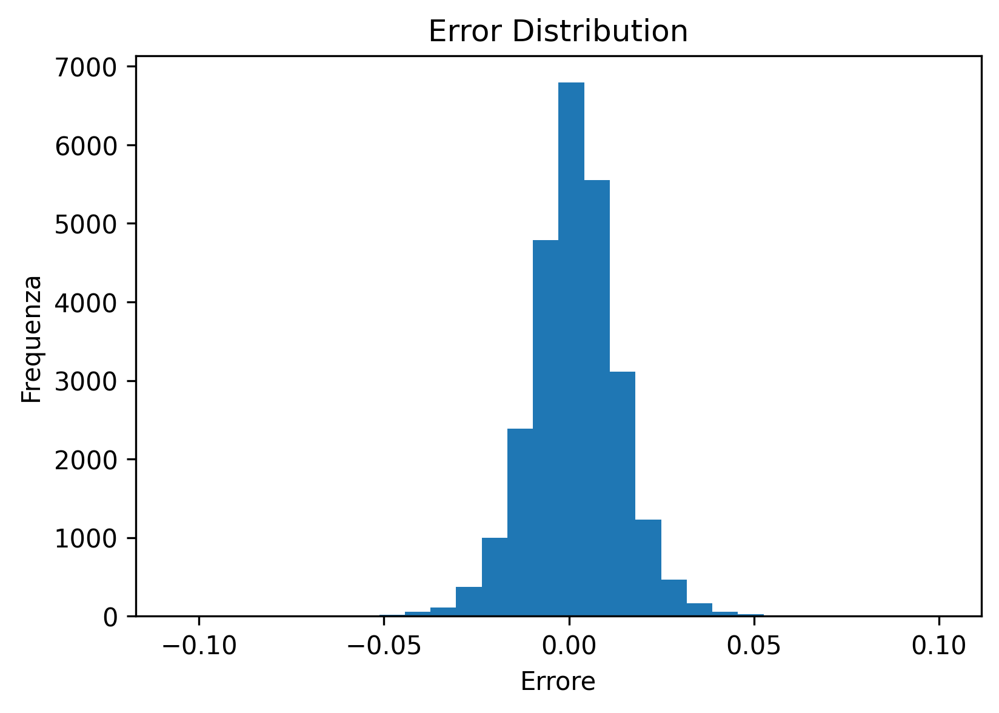
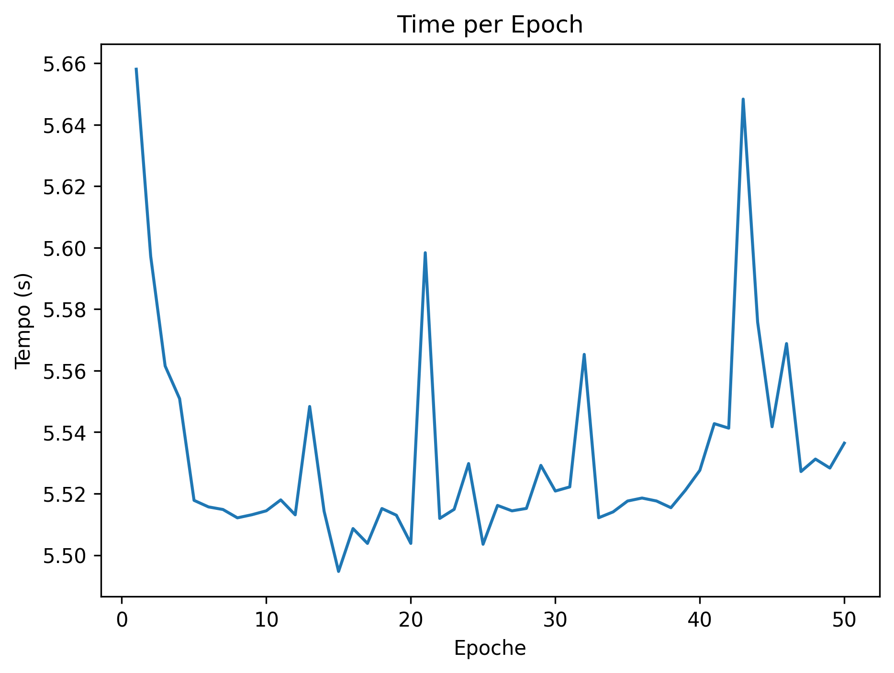
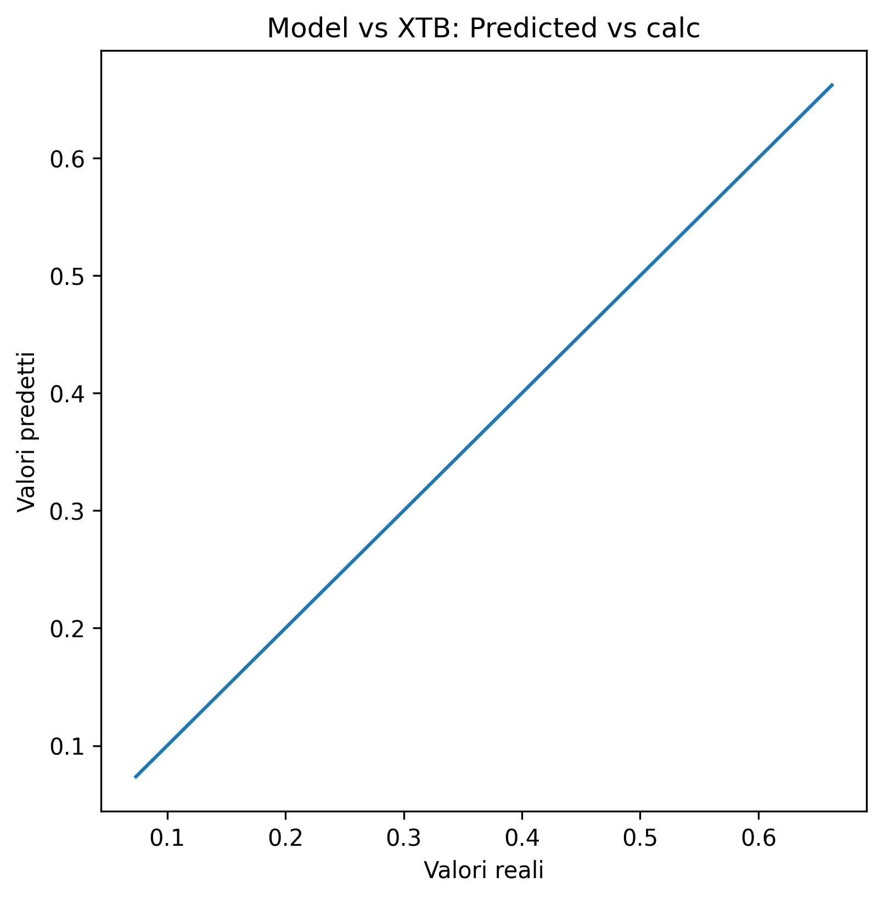
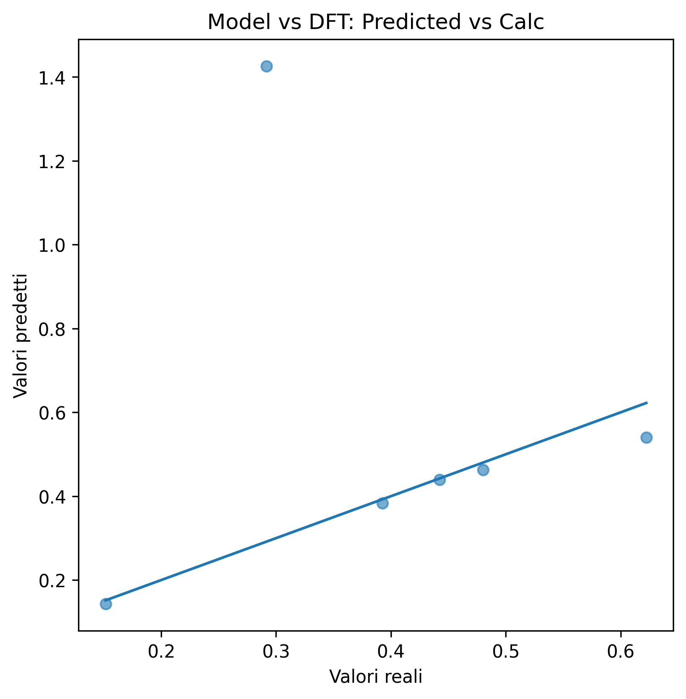

# Molecular GNN Benchmark for HOMO-LUMO Gap Prediction

<p align="center">
  
  
  
  
</p>

This repository contains a graph-based deep learning workflow for predicting molecular HOMO-LUMO gaps from molecular structures.

The project combines **computational chemistry**, **cheminformatics**, **scientific programming** and **Graph Neural Networks**. Molecules are converted from SMILES into graph structures using RDKit and processed with a GNN model implemented in PyTorch Geometric.

The workflow also includes external molecule prediction and comparison against xTB/DFT reference calculations.

---

## Project Goal

The goal of this project is to develop a reproducible molecular machine learning pipeline for HOMO-LUMO gap prediction.

The HOMO-LUMO gap is an important electronic property related to molecular stability, reactivity and optical behavior.

This project explores how Graph Neural Networks can learn molecular electronic properties directly from molecular graph representations.

---

## Workflow

The current pipeline includes:

- QM9 molecular data parsing
- SMILES extraction
- molecular graph construction with RDKit
- PyTorch Geometric graph dataset creation
- GNN regression model training
- model evaluation and visualization
- prediction on external molecular datasets
- comparison with xTB and DFT reference calculations

---

## Model

The model is a Graph Neural Network implemented with PyTorch Geometric.

Main components:

- graph convolution layers
- atom-level molecular features
- molecular graph representation from SMILES
- global graph pooling
- fully connected regression head
- HOMO-LUMO gap prediction as a regression task

Atom-level features include:

- atomic number
- atom degree
- formal charge
- aromaticity
- total number of hydrogens
- implicit valence
- explicit valence
- ring membership

---

## Dataset

The model was trained on a QM9-derived molecular dataset.

| Property | Value |
|---|---:|
| Molecules | 130,680 |
| Train size | 104,544 |
| Test size | 26,136 |
| Target property | HOMO-LUMO gap |

---

## Results

Current benchmark results:

| Metric | Value |
|---|---:|
| MAE | 0.0091 |
| RMSE | 0.0120 |
| R² | 0.9365 |

These results show that the model can learn a meaningful relationship between molecular graph structure and the HOMO-LUMO gap.

---

## Evaluation Plots

<p align="center">
  
  
</p>

<p align="center">
  
  
</p>

---

## External Molecule Prediction

The repository includes scripts for applying the trained GNN model to external molecular datasets.

The external prediction workflow includes:

1. reading molecular structures from SDF files
2. extracting canonical SMILES
3. converting molecules into graph objects
4. loading the trained GNN model
5. predicting HOMO-LUMO gaps
6. ranking molecules by predicted gap

This part of the project represents a first step toward molecular screening workflows using graph-based deep learning.

---

## xTB and DFT Benchmarking

The project also includes a benchmarking workflow against quantum chemistry calculations.

The workflow includes:

- generating molecular geometries
- running xTB calculations
- extracting HOMO and LUMO values
- computing reference HOMO-LUMO gaps
- generating Gaussian input files for DFT calculations
- comparing GNN predictions with xTB/DFT reference values

<p align="center">
  
  
</p>

This provides a connection between data-driven molecular prediction and computational chemistry validation.

---

## Project Structure

```text
HOMO-LUMO_gap_prediction/
├── data/
├── figures/
├── models/
├── notebooks/
├── results/
├── script/
├── src/
│   ├── main.py
│   ├── pred.py
│   ├── result_modello.py
│   ├── graph/
│   ├── modello/
│   ├── parser/
│   ├── plots/
│   └── xtb_DFT/
├── requirements.txt
├── LICENSE
└── README.md
```

---

## Technologies

- Python
- PyTorch
- PyTorch Geometric
- RDKit
- NumPy
- Pandas
- Matplotlib
- scikit-learn
- xTB
- Gaussian/DFT workflow
- Linux/Bash

---

## How to Run

Clone the repository:

```bash
git clone https://github.com/mic334/HOMO-LUMO_gap_prediction.git
cd HOMO-LUMO_gap_prediction
git checkout graph_nn_benchmark
```

Install dependencies:

```bash
pip install -r requirements.txt
```

Run the main pipeline:

```bash
cd src
python main.py
```

Run prediction on external molecules:

```bash
python pred.py
```

Run post-processing and xTB/DFT comparison:

```bash
python result_modello.py
```

---

## Current Status

This project is an experimental benchmark for molecular property prediction using Graph Neural Networks.

Current features:

- molecular graph construction from SMILES
- GNN model training
- HOMO-LUMO gap prediction
- model evaluation
- external molecule prediction
- xTB/DFT comparison workflow
- visualization of model performance

Future improvements:

- additional GNN architectures
- cleaner configuration files
- Docker/Singularity support
- HPC-ready training scripts
- model explainability for molecular graphs

---

## Why This Project Matters

This project demonstrates how computational chemistry workflows can be integrated with modern AI methods.

It shows practical experience with:

- scientific programming
- molecular machine learning
- graph neural networks
- deep learning model training
- chemical data processing
- benchmarking against quantum chemistry calculations
- reproducible scientific workflows

---

## License

This project is released under the MIT License.
