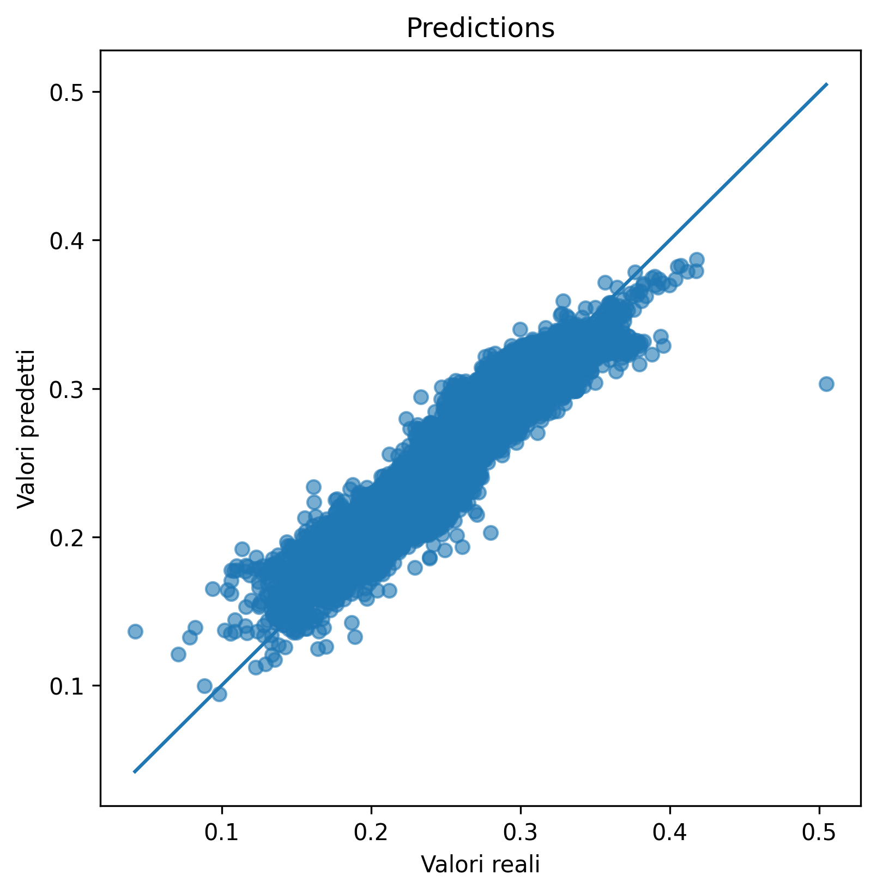
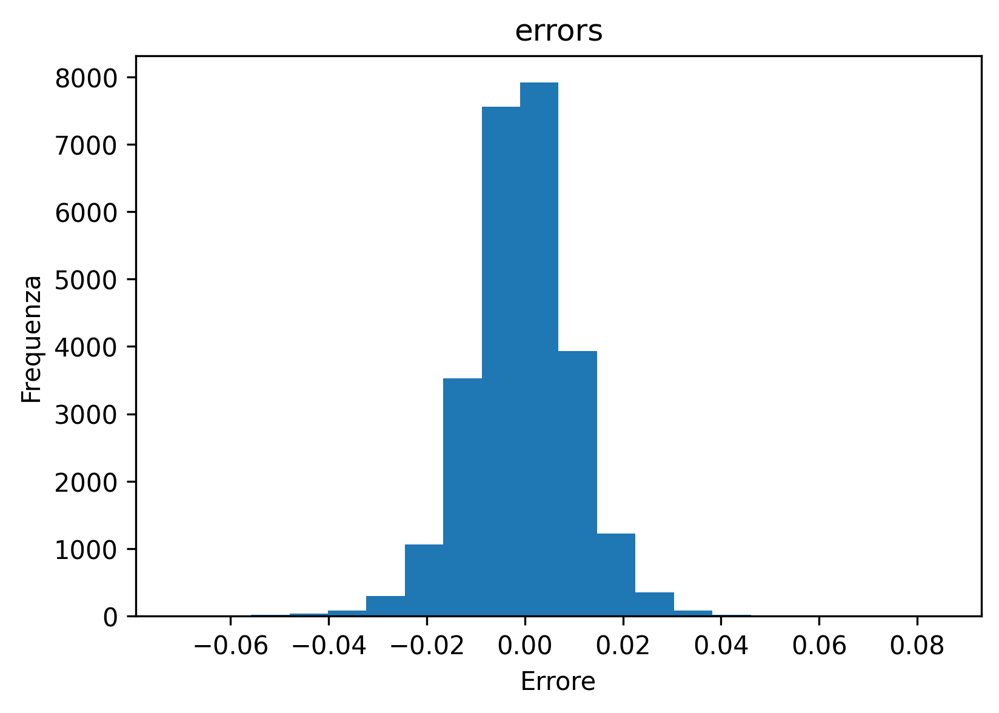
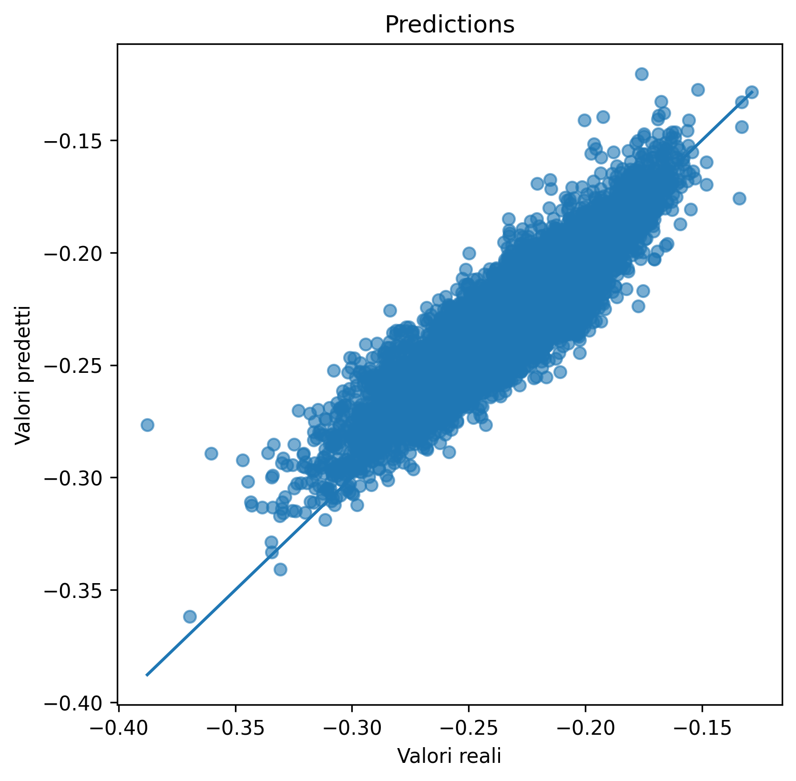
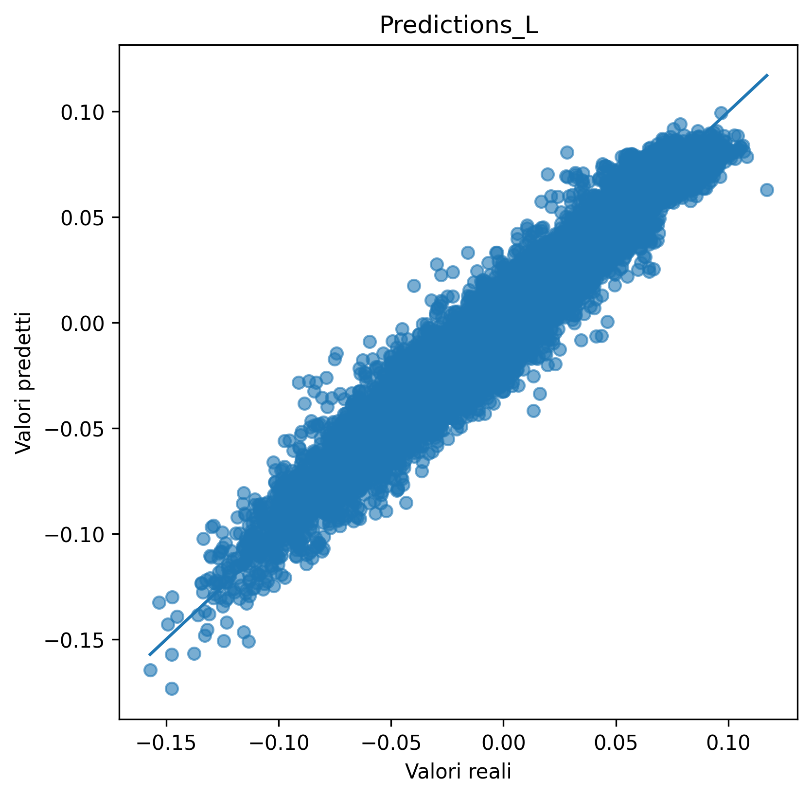
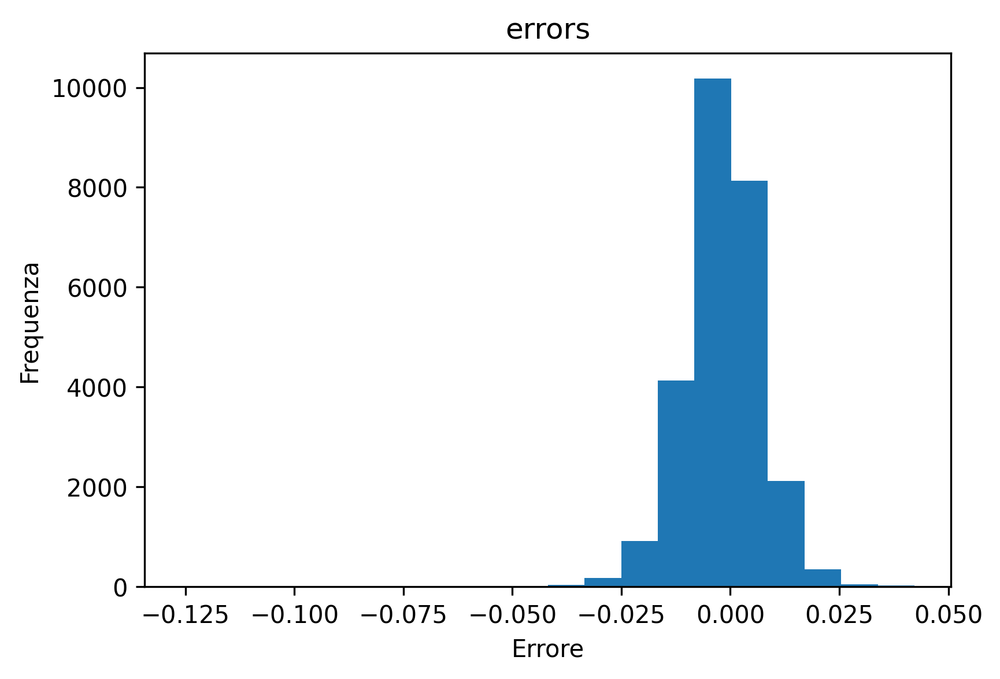
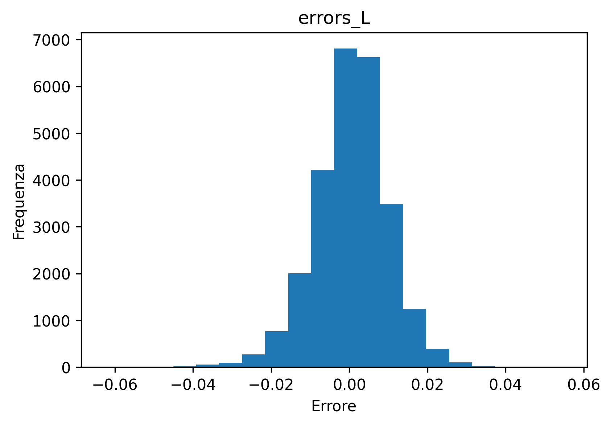

# Direct vs Derived HOMO-LUMO Gap Prediction with GNNs

<p align="center">
  
  
  
  
</p>

This branch explores different Graph Neural Network strategies for predicting molecular HOMO-LUMO gaps from SMILES representations.

The project combines computational chemistry, molecular graph representations and deep learning using RDKit, PyTorch and PyTorch Geometric.

---

## Project Goal

The goal is to compare two strategies for HOMO-LUMO gap prediction:

1. **Direct prediction**
   A GNN is trained directly on the HOMO-LUMO gap.

2. **Derived prediction**
   A GNN predicts HOMO and LUMO separately, and the gap is computed as:

```text
HOMO-LUMO gap = LUMO - HOMO
```

By comparing the direct gap prediction with the derived gap prediction, the model disagreement can be used as a diagnostic signal.

Large differences between the two predictions may indicate molecules where the model is less reliable or farther from the reference value.

---

## Workflow

The pipeline includes:

- molecular dataset parsing
- SMILES extraction
- molecular graph construction with RDKit
- PyTorch Geometric dataset creation
- GNN training for regression
- direct HOMO-LUMO gap prediction
- HOMO and LUMO prediction
- derived gap calculation
- comparison between prediction strategies
- error analysis and visualization

---

## Model

The model is a Graph Neural Network implemented with PyTorch Geometric.

Main components:

- graph convolution layers
- atom-level molecular features
- global pooling
- regression head for molecular property prediction

Atom features include atomic number, degree, formal charge, aromaticity, hydrogens, valence information and ring membership.

---

## Results and Plots

The branch includes plots for gap, HOMO and LUMO predictions, together with their error distributions.

<p align="center">
  
  
</p>

<p align="center">
  
  
</p>

<p align="center">
  
  
</p>

---

## Project Structure

```text
HOMO-LUMO_gap_prediction/
├── data/
├── models/
├── results_models/
├── src/
│   ├── build_model.py
│   ├── pred.py
│   ├── pred_conf_QM9_Alchemy.py
│   ├── graph/
│   ├── modello/
│   ├── parser/
│   └── plots/
├── requirements.txt
├── LICENSE
└── README.md
```

---

## Technologies

- Python
- PyTorch
- PyTorch Geometric
- RDKit
- NumPy
- Pandas
- scikit-learn
- Matplotlib
- Graph Neural Networks
- Molecular machine learning

---

## How to Run

Clone the repository and switch to this branch:

```bash
git clone https://github.com/mic334/HOMO-LUMO_gap_prediction.git
cd HOMO-LUMO_gap_prediction
git checkout direct_vs_derived_gap
```

Install dependencies:

```bash
pip install -r requirements.txt
```

Train the models:

```bash
cd src
python build_model.py
```

Run prediction and comparison:

```bash
python pred_conf_QM9_Alchemy.py
```

---

## Current Status

This branch is an experimental benchmark for comparing direct and derived HOMO-LUMO gap prediction strategies.

Current features:

- GNN model for direct gap prediction
- GNN model for HOMO and LUMO prediction
- derived gap calculation
- prediction disagreement analysis
- error visualization

Future improvements:

- cleaner configuration files
- saved metrics in CSV/JSON format
- uncertainty analysis
- additional GNN architectures
- Docker/Singularity support
- HPC-ready scripts

---

## License

This project is released under the MIT License.
